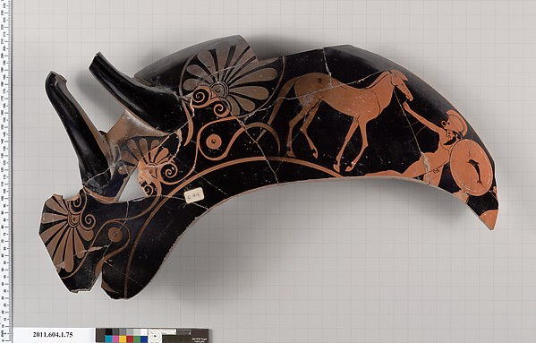

# Kylix Fragment Classifier

App to call Neural network for the classification of Kylix fragments as 'archaic' or 'classical'.

This project was undertaken as an introduction to deep learning and React.

Training code is based on fast.ai's [Practical Deep Learning](https://course.fast.ai) course material.

The data was obtained through the [MET API](https://metmuseum.github.io). All images used for training are in the public domain.

